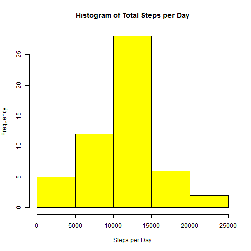
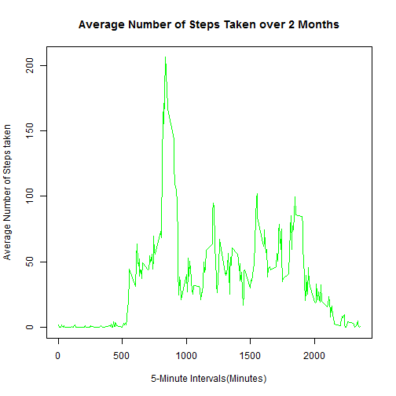
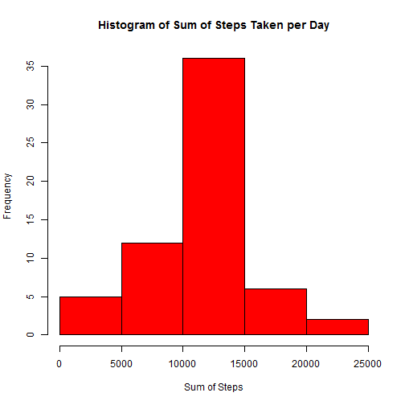

#Peer Assessment 1 


---
output: html_document
---

##Loading the data and necessary packages

```r
activity <- read.csv("activity.csv")
library(ggplot2)
library(knitr)
```

##Mean total number of steps per day with NAs removed

```r
y <- is.na(activity$steps)
act <- activity[!y,]
total <- aggregate(act$steps, by = list(act$date), sum)
```

A histogram of the Total number of steps per day.


```r
hist(total$x, xlab = "Steps per Day", main = "Histogram of Total Steps per Day", col = "yellow")
```

 

The mean and median of the total steps per day are below:

```r
mean(total$x)
```

```
## [1] 10766.19
```

```r
median(total$x)
```

```
## [1] 10765
```

##Average Daily Activity Pattern

```r
avg <- aggregate(act$steps, by = list(act$interval), mean)
colnames(avg) <- c("interval", "means")
```

A graph of the average number of steps per 5-Minute-Interval.

```r
plot(avg$interval, avg$means, type = "l", xlab = "5-Minute Intervals(Minutes)", ylab = "Average Number of Steps taken", main = "Average Number of Steps Taken over 2 Months", col = "green")
```

 


The 5-Minute-Interval with the highest number of steps is avg

```r
avg[avg$means==max(avg$means),]
```

```
##     interval    means
## 104      835 206.1698
```

##Imputing Missing Values

The total number of NAs in the original data is 

```r
sum(y == "TRUE") 
```

```
## [1] 2304
```
In an effort to create a more accurate dataset and account for the large number of missing values, using the average number of steps for each interval, I replaced each NA in the steps with the average value for that time interval. For example, the average number of steps at 10 minutes was 0.1320755 so any missing step value at the 10 minute interval will be replaced with this value. Because the intervals are broken up into such small numbers across a 61 day time period, they provide a lot of information regarding what happened at specific points of the study. Therefore, they are a suitable estimate of the missing data. 


```r
new <- merge(activity, avg, by = "interval")
i = 1
for (i in 1:nrow(new)){
  if (is.na(new$steps)[i] == "TRUE"){
    new$steps[i] <- new$means[i]
  }
  i = i + 1
}
new <- new[-c(4)]
```

This new dataframe, appropriately named "new", has the estimated values of the NAs imputed in. 

```r
newsum <- aggregate(new$steps, by = list(new$date), sum)
```
Below is a histogram of the total number of steps per day with all missing values replaced with estimates.


```r
hist(newsum$x, xlab = "Sum of Steps", main = "Histogram of Sum of Steps Taken per Day", col = "red")
```

 

The new mean and median for the day are 

```r
mean(newsum$x)
```

```
## [1] 10766.19
```

```r
median(newsum$x) 
```

```
## [1] 10766.19
```
The new mean value is exactly the same as the original, however, the median is very slightly different. This shows that imputing values based on means does not create a large impact in the results. Because these new values were put in based on the other steps values, the data isn't too different.

##Activity Patterns on Weekends vs. Weekdays

```r
new$date <- as.Date(new$date)
new$date <- weekdays(new$date)
factors <- factor(new$date %in% c("Sunday","Saturday"), levels = c(TRUE, FALSE), labels = c("weekend", "weekday"))
new1 <- cbind(new, factors)
```

new1 is a new dataframe which includes the new factors weekend and weekday to specifiy which days of the week fall into either level. 

```r
wday <- aggregate(new1$steps, by = list(new1$interval, new1$factors), mean)
colnames(wday) <- c("interval","day_of_week", "steps")
```
Below is a panel plot containing a time series of the average number of steps taken across all weekdays and weekend days.

```r
qplot(interval, steps, data=wday, facets = day_of_week~.) + geom_line()
```

 
